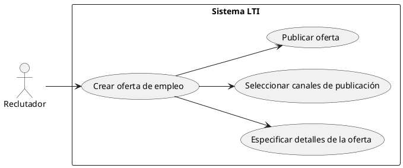
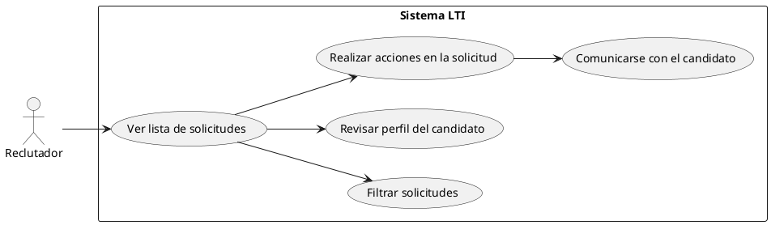
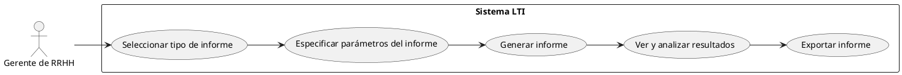
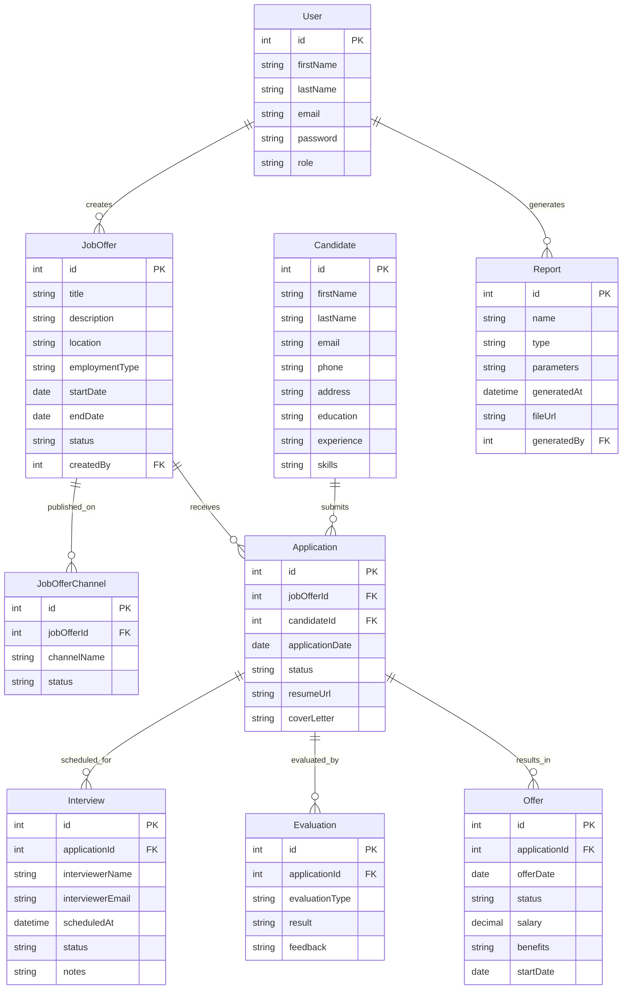

# Descripción de LTI:
LTI es un Sistema de Seguimiento de Candidatos (ATS) innovador y completo, diseñado para optimizar y agilizar el proceso de contratación de las empresas. Con una interfaz intuitiva y funcionalidades avanzadas, LTI permite a los equipos de reclutamiento gestionar de manera eficiente todas las etapas del ciclo de contratación, desde la publicación de ofertas hasta la selección final de candidatos.

# Valor añadido
1. Integración perfecta con sistemas existentes: LTI se destaca por su capacidad para integrarse sin problemas con una amplia gama de sistemas y herramientas utilizados por las empresas, como software de gestión de recursos humanos, plataformas de evaluación y sistemas de verificación de antecedentes. Esto garantiza un flujo de datos fluido, minimiza los errores y proporciona una experiencia de usuario coherente y unificada, abordando uno de los principales pain points de los ATS.

2. Personalización avanzada y adaptabilidad: LTI ofrece opciones de personalización avanzadas que permiten a las empresas adaptar el software a sus procesos y necesidades específicas. Desde la configuración de flujos de trabajo personalizados hasta la creación de campos y formularios a medida, LTI brinda la flexibilidad necesaria para optimizar el proceso de contratación según los requisitos únicos de cada empresa, superando las limitaciones de personalización de muchos ATS.

3. Experiencia de usuario intuitiva y atractiva: LTI se enorgullece de su interfaz de usuario altamente intuitiva, atractiva y fácil de usar, tanto para reclutadores como para candidatos. Con una navegación fluida, una estructura clara y una curva de aprendizaje mínima, LTI garantiza una adopción rápida, una experiencia de usuario excepcional y una mayor satisfacción de los usuarios, abordando los problemas comunes de usabilidad de los ATS.

4. Comunicación enriquecida con los candidatos: LTI ofrece funcionalidades avanzadas de comunicación con los candidatos, incluyendo mensajería personalizada, programación de entrevistas directamente desde el sistema y un portal de candidatos completo. Esto permite una comunicación fluida, mejora la experiencia del candidato y agiliza el proceso de contratación, superando las limitaciones de comunicación de muchos ATS.

# Ventajas competitivas
1. Automatización inteligente con IA y aprendizaje automático: LTI aprovecha la inteligencia artificial y el aprendizaje automático para automatizar tareas repetitivas, realizar recomendaciones de candidatos y optimizar la búsqueda y el filtrado de perfiles. Estas capacidades avanzadas mejoran la eficiencia del proceso de contratación, ahorran tiempo y recursos, y ayudan a identificar a los mejores talentos, superando las limitaciones de los ATS tradicionales.

2. Tecnología de parsing de currículums avanzada: LTI utiliza algoritmos de vanguardia y técnicas de procesamiento de lenguaje natural para analizar y extraer con precisión la información de los currículums de los candidatos, independientemente del formato o diseño utilizado. Esto garantiza una captura completa de datos, reduce la necesidad de revisiones manuales y agiliza el proceso de selección, abordando los problemas comunes de parsing de currículums de los ATS.

3. Analíticas avanzadas y reporting: LTI proporciona analíticas avanzadas y capacidades de reporting que permiten a las empresas obtener información valiosa sobre el proceso de contratación. Con métricas clave, paneles interactivos y la capacidad de generar informes personalizados, LTI ayuda a las empresas a tomar decisiones basadas en datos, identificar áreas de mejora y optimizar continuamente sus estrategias de contratación, superando las limitaciones de análisis de datos de muchos ATS.

4. Escalabilidad y alto rendimiento: LTI se construye sobre una arquitectura escalable y de alto rendimiento, garantizando un funcionamiento rápido y sin problemas, incluso con grandes volúmenes de datos y múltiples usuarios simultáneos. Con una infraestructura robusta y tecnologías de optimización avanzadas, LTI ofrece una experiencia de usuario fluida, tiempos de carga ultrarrápidos y la capacidad de adaptarse al crecimiento de la empresa, abordando los problemas comunes de velocidad y rendimiento de los ATS.

5. Modelo de precios flexible y transparente: LTI ofrece un modelo de precios flexible y transparente, adaptado a las necesidades y presupuestos de diferentes empresas. Con opciones de suscripción adaptables, precios competitivos y sin costos ocultos, LTI garantiza un retorno de inversión sólido y un valor excepcional para sus clientes, abordando los desafíos de costos elevados de algunos ATS.

# Funciones principales:
1. Publicación de ofertas de empleo multicanal: LTI permite crear y publicar ofertas de trabajo en múltiples canales, incluyendo el sitio web de la empresa, tableros de empleo, redes sociales y plataformas especializadas. Además, LTI ofrece integraciones perfectas con estos canales, garantizando una sincronización automática de las ofertas y una mayor visibilidad para atraer a candidatos cualificados.

2. Gestión avanzada de solicitudes: LTI proporciona una gestión avanzada de solicitudes que simplifica y agiliza el proceso de revisión y selección de candidatos. Con funcionalidades como la recopilación automática de solicitudes, la clasificación inteligente basada en criterios predefinidos, la colaboración en tiempo real del equipo de reclutamiento y la posibilidad de realizar acciones masivas, LTI optimiza significativamente la gestión de solicitudes.

3. Búsqueda y filtrado inteligente de candidatos: LTI utiliza tecnologías avanzadas de búsqueda y filtrado, incluyendo algoritmos de búsqueda semántica, correspondencia automática de perfiles y recomendaciones basadas en inteligencia artificial. Esto permite a los reclutadores encontrar rápidamente a los candidatos más adecuados según criterios específicos, como habilidades, experiencia, ubicación y otros requisitos del puesto, mejorando la calidad de las contrataciones.

4. Comunicación personalizada y automatizada: LTI ofrece funcionalidades avanzadas de comunicación con los candidatos, permitiendo la personalización de mensajes, la programación automatizada de entrevistas y el seguimiento proactivo del proceso de contratación. Además, LTI incluye un portal de candidatos completo donde los postulantes pueden actualizar su información, realizar un seguimiento de su solicitud y comunicarse directamente con el equipo de reclutamiento, mejorando significativamente la experiencia del candidato.

5. Evaluaciones y pruebas integradas: LTI se integra a la perfección con herramientas de evaluación y pruebas en línea, permitiendo a las empresas aplicar cuestionarios, pruebas de habilidades y evaluaciones psicométricas directamente desde la plataforma. Los resultados se sincronizan automáticamente con los perfiles de los candidatos, brindando una visión completa y facilitando la toma de decisiones basada en datos objetivos.

6. Onboarding digital y gestión de contrataciones: LTI streamline el proceso de onboarding y la gestión de contrataciones con funcionalidades como la generación automática de documentos, la firma electrónica de contratos y la integración con el sistema de gestión del capital humano de la empresa. Esto reduce el trabajo manual, minimiza los errores y garantiza una transición fluida de los candidatos seleccionados a empleados activos.

7. Analíticas avanzadas y reporting personalizado: LTI ofrece analíticas avanzadas y capacidades de reporting que brindan información valiosa sobre el rendimiento del proceso de contratación. Con métricas clave, paneles interactivos y la posibilidad de generar informes personalizados, LTI permite a las empresas identificar tendencias, medir la eficacia de las estrategias de reclutamiento y tomar decisiones basadas en datos para la mejora continua.

8. Personalización y configuración flexible: LTI se destaca por su alto grado de personalización y configuración, permitiendo a las empresas adaptar la plataforma a sus procesos y requisitos específicos. Desde la creación de flujos de trabajo personalizados hasta la configuración de campos y formularios dinámicos, LTI ofrece una flexibilidad inigualable para garantizar que el software se ajuste perfectamente a las necesidades únicas de cada empresa.

# Diagrama Lean Canvas:

| Problem                                                     | Solution                                                      | Unique Value Proposition                                                                                                                                                                                                                                                                                                                                                                                                                                                                                                                                                         |
|-------------------------------------------------------------|---------------------------------------------------------------|----------------------------------------------------------------------------------------------------------------------------------------------------------------------------------------------------------------------------------------------------------------------------------------------------------------------------------------------------------------------------------------------------------------------------------------------------------------------------------------------------------------------------------------------------------------------------------|
| 1. Procesos de contratación ineficientes y manuales         | 1. Automatización inteligente con IA y aprendizaje automático | LTI es un ATS innovador y completo que optimiza y agiliza el proceso de contratación de principio a fin. Con su enfoque en la integración perfecta, la personalización avanzada, la experiencia de usuario intuitiva y las funcionalidades avanzadas como la automatización inteligente, la búsqueda y filtrado inteligente de candidatos, las analíticas avanzadas y la comunicación enriquecida, LTI supera las limitaciones de los ATS tradicionales y ofrece una solución integral para atraer, seleccionar y contratar al mejor talento de manera más eficiente y efectiva. |
| 2. Dificultad para atraer y seleccionar talento cualificado | 2. Búsqueda y filtrado inteligente de candidatos              |                                                                                                                                                                                                                                                                                                                                                                                                                                                                                                                                                                                  |
| 3. Falta de integración con sistemas existentes             | 3. Integración perfecta con sistemas existentes               |                                                                                                                                                                                                                                                                                                                                                                                                                                                                                                                                                                                  |
| 4. Limitaciones de personalización y adaptabilidad          | 4. Personalización avanzada y adaptabilidad                   |                                                                                                                                                                                                                                                                                                                                                                                                                                                                                                                                                                                  |
| 5. Experiencia de usuario deficiente                        | 5. Experiencia de usuario intuitiva y atractiva               |                                                                                                                                                                                                                                                                                                                                                                                                                                                                                                                                                                                  |
| 6. Problemas de comunicación con candidatos                 | 6. Comunicación personalizada y automatizada                  |                                                                                                                                                                                                                                                                                                                                                                                                                                                                                                                                                                                  |
| 7. Falta de analíticas y reporting avanzados                | 7. Analíticas avanzadas y reporting personalizado             |                                                                                                                                                                                                                                                                                                                                                                                                                                                                                                                                                                                  |

| Key Metrics                                   | Channels                             | Customer Segments                                                                    |
|-----------------------------------------------|--------------------------------------|--------------------------------------------------------------------------------------|
| 1. Tiempo de contratación                     | 1. Sitio web propio                  | 1. Empresas medianas y grandes con procesos de contratación complejos                |
| 2. Tasa de conversión de candidatos           | 2. Redes sociales                    | 2. Sectores con alta rotación y necesidades de contratación recurrentes              |
| 3. Satisfacción de candidatos y empleadores   | 3. Eventos y conferencias del sector | 3. Empresas en crecimiento que buscan escalar sus procesos de contratación           |
| 4. Adopción y uso de la plataforma            | 4. Asociaciones y partnerships       | 4. Organizaciones con requisitos de cumplimiento normativo estrictos                 |
| 5. Mejora en la calidad de las contrataciones | 5. Marketing de contenidos           | 5. Departamentos de recursos humanos que buscan optimizar sus estrategias de talento |

| Cost Structure                                       | Revenue Streams                                             |
|------------------------------------------------------|-------------------------------------------------------------|
| 1. Desarrollo y mantenimiento de la plataforma       | 1. Suscripciones mensuales o anuales                        |
| 2. Infraestructura y hosting                         | 2. Tarifas por implementación y onboarding personalizado    |
| 3. Equipo de ventas, marketing y soporte             | 3. Servicios adicionales y consultoría                      |
| 4. Investigación y desarrollo para mejoras continuas | 4. Licencias por volumen para grandes empresas              |
| 5. Cumplimiento normativo y seguridad de datos       | 5. Ingresos por publicidad de ofertas de trabajo destacadas |

# 3 Casos de uso principales:

1. Caso de uso: Publicación de una oferta de empleo



En este caso de uso, el reclutador interactúa con el sistema LTI para crear una nueva oferta de empleo. El reclutador especifica los detalles de la oferta, selecciona los canales de publicación adecuados y publica la oferta.

2. Caso de uso: Gestión de solicitudes de candidatos



En este caso de uso, el reclutador utiliza el sistema LTI para gestionar las solicitudes de los candidatos. El reclutador puede ver la lista de solicitudes, filtrarlas según criterios específicos, revisar los perfiles de los candidatos, realizar acciones en las solicitudes (como programar entrevistas o tomar decisiones) y comunicarse con los candidatos directamente desde el sistema.

3. Caso de uso: Generación de informes y análisis



En este caso de uso, el gerente de recursos humanos interactúa con el sistema LTI para generar informes y análisis sobre el proceso de contratación. El gerente selecciona el tipo de informe deseado, especifica los parámetros necesarios, genera el informe, ve y analiza los resultados y, si es necesario, exporta el informe para su posterior distribución o uso.

# Modelo de datos:



1. La entidad `User` representa a los usuarios del sistema, como reclutadores y gerentes de RRHH, con atributos como nombre, apellido, correo electrónico, contraseña y rol.

2. La entidad `JobOffer` representa las ofertas de empleo publicadas, con atributos como título, descripción, ubicación, tipo de empleo, fechas de inicio y fin, estado y el usuario que la creó.

3. La entidad `JobOfferChannel` representa los canales en los que se publica una oferta de empleo, con atributos como el ID de la oferta, el nombre del canal y el estado.

4. La entidad `Candidate` representa a los candidatos que se postulan a las ofertas, con atributos como nombre, apellido, correo electrónico, teléfono, dirección, educación, experiencia y habilidades.

5. La entidad `Application` representa las postulaciones realizadas por los candidatos a las ofertas de empleo, con atributos como el ID de la oferta, el ID del candidato, la fecha de postulación, el estado, la URL del currículum y la carta de presentación.

6. La entidad `Interview` representa las entrevistas programadas para una postulación, con atributos como el ID de la postulación, el nombre y correo electrónico del entrevistador, la fecha y hora programada, el estado y las notas.

7. La entidad `Evaluation` representa las evaluaciones realizadas a una postulación, con atributos como el ID de la postulación, el tipo de evaluación, el resultado y la retroalimentación.

8. La entidad `Offer` representa las ofertas de trabajo realizadas a una postulación, con atributos como el ID de la postulación, la fecha de la oferta, el estado, el salario, los beneficios y la fecha de inicio.

9. La entidad `Report` representa los informes generados en el sistema, con atributos como el nombre, el tipo, los parámetros, la fecha y hora de generación, la URL del archivo y el usuario que lo generó.

# Diseño del sistema a alto nivel:


```python
from diagrams import Cluster, Diagram
from diagrams.aws.compute import Lambda
from diagrams.aws.database import RDS, Elasticache
from diagrams.aws.network import APIGateway, CloudFront
from diagrams.aws.security import Cognito
from diagrams.aws.storage import S3
from diagrams.aws.integration import SQS
from diagrams.aws.management import Cloudwatch
from diagrams.onprem.client import User

with Diagram("LTI System Architecture", show=False):
    users = User("Users")
    cdn = CloudFront("CloudFront")

    with Cluster("Frontend"):
        frontend = S3("ReactJS App")

    with Cluster("Backend"):
        api_gateway = APIGateway("API Gateway")
        cognito = Cognito("Cognito")

        with Cluster("Microservices"):
            job_offers = Lambda("Job Offers")
            candidates = Lambda("Candidates")
            applications = Lambda("Applications")
            interviews = Lambda("Interviews")
            evaluations = Lambda("Evaluations")
            reports = Lambda("Reports")

        with Cluster("Data Store"):
            database = RDS("PostgreSQL")
            search = Elasticache("Elasticsearch")

        file_storage = S3("S3 File Storage")
        message_queue = SQS("SQS")
        monitoring = Cloudwatch("CloudWatch")

    users >> cdn >> frontend
    frontend >> api_gateway
    api_gateway >> cognito
    api_gateway >> job_offers >> database
    api_gateway >> candidates >> database
    api_gateway >> applications >> database
    api_gateway >> interviews >> database
    api_gateway >> evaluations >> database
    api_gateway >> reports >> database
    database >> search
    job_offers >> file_storage
    candidates >> file_storage
    applications >> file_storage
    interviews >> message_queue
    evaluations >> message_queue
    monitoring >> [job_offers, candidates, applications, interviews, evaluations, reports]
```

El sistema LTI seguirá una arquitectura de microservicios basada en la nube, aprovechando servicios de AWS para garantizar escalabilidad, flexibilidad y alta disponibilidad. El sistema constará de los siguientes componentes principales:

1. Frontend de aplicación: Una aplicación web responsive desarrollada con React, que se alojará en Amazon S3 y se distribuirá a través de Amazon CloudFront para una entrega de contenido rápida y eficiente.

2. API Gateway: Amazon API Gateway actuará como punto de entrada para todas las solicitudes de API, enrutándolas a los microservicios correspondientes y gestionando la autenticación y autorización mediante JWT.

3. Microservicios: Se desarrollarán microservicios independientes utilizando AWS Lambda para las principales funcionalidades del sistema, como gestión de ofertas de empleo, gestión de candidatos, gestión de postulaciones, programación de entrevistas, evaluaciones y generación de informes. Cada microservicio tendrá su propia base de datos y se comunicará con otros servicios a través de API RESTful.

4. Base de datos: Se utilizará Amazon RDS con PostgreSQL como base de datos principal para almacenar los datos estructurados de las entidades del sistema, como usuarios, ofertas de empleo, candidatos y postulaciones. Para búsquedas y filtros rápidos, se empleará Amazon Elasticsearch Service.

5. Almacenamiento de archivos: Amazon S3 se utilizará para almacenar archivos adjuntos, como currículums y documentos relacionados con las postulaciones.

6. Colas de mensajes: Se utilizará Amazon SQS para desacoplar los microservicios y garantizar un procesamiento asíncrono y confiable de las tareas, como el envío de correos electrónicos y las notificaciones.

7. Autenticación y autorización: Amazon Cognito se utilizará para la autenticación y autorización de usuarios, permitiendo el registro, inicio de sesión y gestión de permisos de manera segura y escalable.

8. Monitoreo y registro: Se utilizará Amazon CloudWatch para el monitoreo y el registro de los microservicios, permitiendo la recopilación de métricas, el seguimiento de errores y la configuración de alarmas.

9. Interfaces externas: El sistema se integrará con servicios externos, como proveedores de evaluaciones, plataformas de publicación de empleo y sistemas de gestión de recursos humanos, a través de API y webhooks.

# Diagrama C4 - Componente "Job Offers":

El microservicio de "Job Offers" es responsable de gestionar todas las funcionalidades relacionadas con las ofertas de empleo en el sistema LTI. Esto incluye la creación, actualización, eliminación y recuperación de ofertas de empleo, así como la publicación de ofertas en diferentes canales y la interacción con otros componentes del sistema.

A continuación, se presenta un diagrama C4 que muestra la descomposición del componente "Job Offers" y sus interacciones con otros elementos del sistema.


```python
from diagrams import Cluster, Diagram
from diagrams.aws.compute import Lambda
from diagrams.aws.database import RDS
from diagrams.aws.storage import S3
from diagrams.aws.integration import SQS
from diagrams.onprem.client import User

with Diagram("Job Offers Component - C4 Diagram", show=False):
    users = User("Users")

    with Cluster("LTI System"):
        with Cluster("Frontend"):
            frontend = User("ReactJS App")

        with Cluster("Backend"):
            with Cluster("Job Offers Microservice"):
                job_offers_api = Lambda("Job Offers API")
                job_offers_service = Lambda("Job Offers Service")
                job_offers_repository = Lambda("Job Offers Repository")

            with Cluster("Data Store"):
                database = RDS("PostgreSQL")

            file_storage = S3("S3 File Storage")
            message_queue = SQS("SQS")

            with Cluster("External Services"):
                publishing_platforms = User("Job Publishing Platforms")

    users >> frontend
    frontend >> job_offers_api
    job_offers_api >> job_offers_service
    job_offers_service >> job_offers_repository
    job_offers_repository >> database
    job_offers_service >> file_storage
    job_offers_service >> message_queue
    job_offers_service >> publishing_platforms
```

En este diagrama C4, se descompone el componente "Job Offers" en varios elementos:

1. Job Offers API: Es el punto de entrada para las solicitudes relacionadas con las ofertas de empleo. Recibe las solicitudes del frontend y las enruta al servicio correspondiente.

2. Job Offers Service: Es el servicio principal que maneja la lógica de negocio relacionada con las ofertas de empleo. Se encarga de procesar las solicitudes, aplicar las reglas de negocio y coordinar las interacciones con otros componentes.

3. Job Offers Repository: Es responsable de la persistencia y recuperación de los datos de las ofertas de empleo. Interactúa con la base de datos PostgreSQL para almacenar y obtener la información necesaria.

Además, el componente "Job Offers" interactúa con otros elementos del sistema:

- Se comunica con el componente de almacenamiento de archivos (S3) para guardar y recuperar archivos relacionados con las ofertas de empleo, como descripciones o imágenes.
- Envía mensajes a la cola de mensajes (SQS) para desacoplar y asincronizar ciertas tareas, como la publicación de ofertas en plataformas externas.
- Interactúa con servicios externos, como plataformas de publicación de empleo, para publicar las ofertas en diferentes canales.
